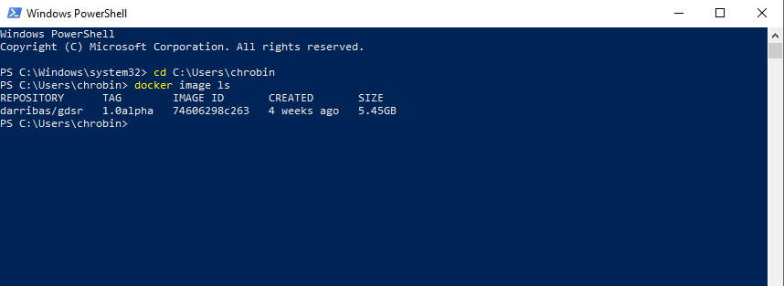

# Windows 10 Pro/Education {#win10pro .unnumbered}

This guide shows you how to install Docker and run R/RStudio virtually using an environment we have created called `darribas/gdsr:1.0alpha` [@gds_env]. This approach is preferred for anyone using 'Windows 10 Pro/Education' because it avoids potential compatibility issues between the latest versions of R/RStudio and other software on your computer. 

**Please therefore follow these steps even if R/RStudio is already installed on your computer.**

<br>

## Installing Docker {.unlisted .unnumbered}

### Requirements {.unlisted .unnumbered}

To be able to complete this guide, your machine will need to meet the following requirements:

1. A stable internet connection
2. ~10GB of space on your hard drive
3. Windows 10 64-bit: Pro, Enterprise, or Education (Build 16299 or later). You can see the full requirements on the official [Docker for Windows page](https://docs.docker.com/docker-for-windows/install/).

<div class="alert alert-danger" style="font-size:120%">
<b>IMPORTANT</b>: <br>
    
If you are not sure what version of Windows you are running, check out this [guide](#windows-version).
    
If you know you don't have Windows 10 Pro, for example you are running Windows 10 Home, please use [this install/run guide](#otherWin).
    
</div>
 
### Docker install steps {#winpro_docker_install_steps .unlisted .unnumbered}

Once you have everything required ready to go, the first step is to install the Docker Desktop App for Windows. Here are the steps you can follow:

1. Head over to Docker Hub to download a copy of Docker for Windows:

> [https://hub.docker.com/editions/community/docker-ce-desktop-windows/](https://hub.docker.com/editions/community/docker-ce-desktop-windows/)

```{r winpro_dh, fig.align = 'center', echo = FALSE}
knitr::include_graphics("figs/chp3/InstallDocker1.png")
```
<br>

2. Download a copy of the Docker Desktop (highlighted in red on the image above). Click “Save File”. Note the file is approximately 490Mb so, depending on your internet connection, it might take a while to download. 
3. Double click on the file you downloaded (a cute white whale on a blue background) and the "installation wizard" will appear. 
4. Follow the instructions on the installation wizard to authorize the installer and proceed with the install.

You can check the process has completed successfully by following these steps:

1. Open PowerShell from the "Start Menu"

```{r winpro_ps, fig.align = 'center', echo = FALSE, out.width = "600px"}
knitr::include_graphics("figs/chp3/InstallDocker2.png")
```
<br>

2. Check Docker is available by printing out the version you have installed:

```shell
docker --version
```
Note: Don’t worry if you have you installed a slightly different version of Docker - that’s OK. What you want to make sure is that it successfully prints out a version instead of a warning/error message (usually in red).

```{r winpro_dv, fig.align = 'center', echo = FALSE, out.width = "600px"}

```
<br>


### Installing the container {#winpro_docker_gds .unlisted .unnumbered}

Once you have Docker installed and running on your machine, installing everything you need to run RStudio and associated packages boils down to the following two steps:

1. Open PowerShell following the same steps as above (you can use the same window as before or a fresh new one).
2. Run (type and hit "Enter") the following command:

```shell
docker pull darribas/gdsr:1.0alpha
```

```{r winpro_pull, fig.align = 'center', echo = FALSE, out.width = "600px"}
knitr::include_graphics("figs/chp3/InstallDocker4.png")
```
<br>

You will know this has completed when each line says 'Pull complete'.

<div class="alert alert-info" style="font-size:120%">
<b>IMPORTANT</b>: <br>
    
Make sure you are connected to the internet and it is a stable connection. This step involves the download of large amounts of data (ca. 10GB) so it might take a while. However, it only needs to be run once.
   
</div>

### Check success {#winpro_success .unlisted .unnumbered}

If everything has gone according to plan, you should see `darribas/gdsr` show up on your terminal when you type `docker image ls`:

```{r winpro_success, fig.align = 'center', echo = FALSE, out.width = "600px"}

```
<br>

## Running RStudio Server {#winpro_run .unnumbered}

The following sections cover how to start up the software you have just installed, use it, and shut it down when you are done.

### Running the container {.unlisted .unnumbered}

1. In a new PowerShell window, type the following command to run the container and hit enter: 

```shell
docker run -d -e PASSWORD=test123 -p 8787:8787 -v ${PWD}:/home/rstudio/work darribas/gdsr:1.0alpha
```

```{r fig.align = 'center', echo = FALSE}

```

<br>

You have now started an RStudio session. 


<div class="alert alert-info" style="font-size:120%">
<b>IMPORTANT</b>: <br>
    
Please do NOT close the PowerShell window until you are finished in this RStudio session
   
</div>

2. To access this session go to your chosen web browser (e.g. Firefox/Chrome) and type: `localhost:8888` into the search bar. 
3.	The page that loads will prompt you for a username and password as shown. Type the following:

```shell
username: rstudio
password: test123
```

<br>

```{r fig.align = 'center', echo = FALSE}

```

Now you are in RStudio Server, you can start coding or opening a new file. Please refer to Rowe and Arribas-Bel (2021) for an introduction to the RStudio interface, R Script and R Notebook.

<br>

#### Using RStudio Server {.unlisted .unnumbered}

A R notebook is where you will run your code and can add text. The top header is called YAML metadata and each shaded box is called a kernel (or code chunk) contained within delimiters ```{r} and ```.

Type 1 + 1 into a code chunk. To run the code click the play icon as highlighted in red below.

```{r fig.align = 'center', echo = FALSE}

```

<br>

<div class="alert alert-info" style="font-size:120%">
<b>IMPORTANT</b>: <br>
    
Make sure you save files you want to keep **ONLY** _within_ the `work` folder, as this will ensure they are saved on your machine.
    
Everything saved outside the `work` folder will be _destroyed_ as soon as you shut down the session.
   
</div>

You can access other files on your machine through the work folder in the Files Browser. From here you can navigate to your Documents and designated folder for this module.

```{r fig.align = 'center', echo = FALSE}

```

<br>

Here I am navigating to the san folder that we have created for this module in my Downloads. You can replace this with the pathway to the folder you create for this module.

```{r fig.align = 'center', echo = FALSE}

```

<br>

```{r fig.align = 'center', echo = FALSE}

```

<br>

You can save your notebook here using File > Save As.

```{r  fig.align = 'center', echo = FALSE}

```

<br>

And you can create new folders to organise your work.

```{r fig.align = 'center', echo = FALSE}

```

<br>

### Ending your session {.unlisted .unnumbered}

Once you have finished in your RStudio session and have saved all your work, you can end the session by closing your browser.

```{r fig.align = 'center', echo = FALSE}

```

<br>

Then, type docker container stop and copy the CONTAINER ID from the output above as shown here:

```{r fig.align = 'center', echo = FALSE}

```

You can now safely shut the terminal window.

<br>

Next time you go to run a R Notebook you will NOT need to repeat the whole process as you have already installed Docker and the GDSR environment. Instead you can start from Running the container and carry on from there.
