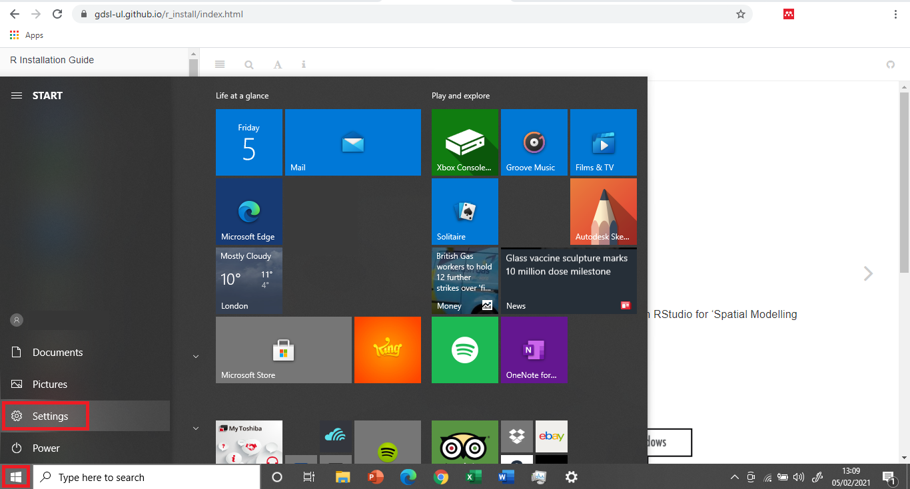
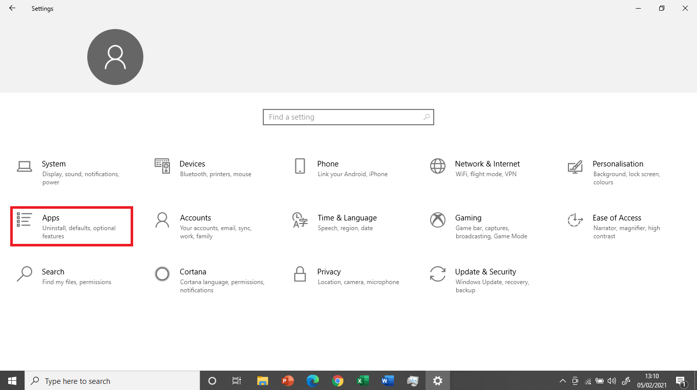
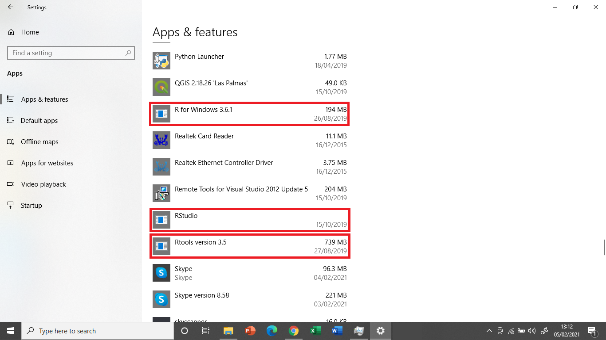
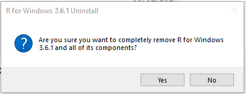
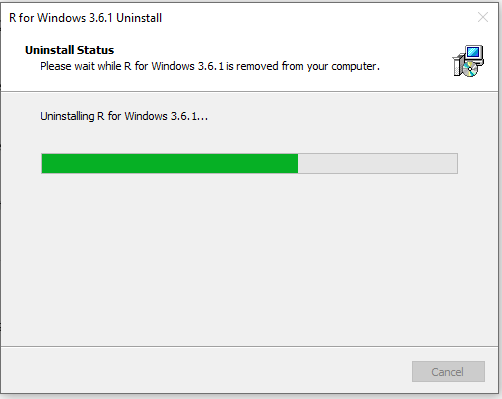
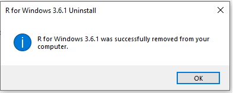

# Windows 10 Home/pre-10 {#otherWin .unnumbered}

This guide covers the installation of R and RStudio on machines running Windows 10 Home Edition or versions of Windows prior to Windows 10 (e.g. Windows 7). With this approach, you will install R and RStudio "natively", that is running directly on your operating system. If you are not sure what version of Windows you are running, check out this [guide](#windows-version).

<div class="alert alert-danger" style="font-size:120%">
<b>IMPORTANT</b>: <br>
    
This module has been written using the most up-to-date versions of R, RStudio and relevant packages. To avoid software compatibility issues it is important you have these same versions installed on your home computer.

**Therefore, if you have R or RStudio already installed on your computer, please first uninstall them unsing the instructions [here](#uninstall_otherwin).**
    
</div>


## Download and Install R  {.unlisted .unnumbered}

### Download R  {.unlisted .unnumbered}

R is the coding software that will execute the code you write in RStudio

**NOTE: You need to install R before you install RStudio**


```{r fig1, fig.align = 'center', echo = FALSE}
knitr::include_graphics("figs/chp4/Picture_1.png")
```

-  Open the [R download page](https://cran.rstudio.com/) in your browser and click on **Download R for Windows**.  

```{r fig2, fig.align = 'center', echo = FALSE}
knitr::include_graphics("figs/chp4/Picture_2.png")
```

-  Click on **base** (highlighted in red here) as you are installing R for the first time. 

```{r fig3, fig.align = 'center', echo = FALSE}
knitr::include_graphics("figs/chp4/Picture_3.png")
```

-  Click on **Download R 4.0.3 for Windows** (highlighted in red here) to start the download. 

### Install R {.unlisted .unnumbered}

```{r fig4, fig.align = 'center', echo = FALSE}
knitr::include_graphics("figs/chp4/Picture_4.png")
```

-	Navigate to your **Downloads** folder and double click on the **_R-4.0.3-win_** file.

**NOTE: Once you double click on the file, a window might pop up that asks you if you want to allow this app to make changes to your device click _YES_ to continue the installation**

```{r fig5, fig.align = 'center', echo = FALSE, out.width = "350px"}
knitr::include_graphics("figs/chp4/R_1.png")
```

-	A new window will pop up asking you to select a language for the installation. Select **English** and click **_OK_**.

```{r fig6, fig.align = 'center', echo = FALSE, out.width = "600px"}
knitr::include_graphics("figs/chp4/R_2.png")
```

-	The next window shows the Terms and Conditions. Click **_Next_** to continue with the installation. 

```{r fig7, fig.align = 'center', echo = FALSE, out.width = "600px"}
knitr::include_graphics("figs/chp4/R_3.png")
```

-	The next window will ask you to specify where you would like to install R. Leave the default settings and click **_Next_**. 

```{r fig8, fig.align = 'center', echo = FALSE, out.width = "600px"}
knitr::include_graphics("figs/chp4/R_4.png")
```

-	The next window will ask you what components of R you want to install. Leave the default settings (all boxes ticked) and click **_Next_**. 


```{r fig9, fig.align = 'center', echo = FALSE, out.width = "600px"}
knitr::include_graphics("figs/chp4/R_5.png")
```

-	The next window will ask you if you want to customise the startup options.
- Select **No** and click **_Next_**.  

```{r fig10, fig.align = 'center', echo = FALSE, out.width = "600px"}
knitr::include_graphics("figs/chp4/R_6.png")
```

-	The next window will ask you to select/name a start menu folder.
- Leave the default settings (R) and click **_Next_**.  

```{r fig11, fig.align = 'center', echo = FALSE, out.width = "600px"}
knitr::include_graphics("figs/chp4/R_7.png")
```

-	The next window will ask you to select additional task that will be performed while installing R.
- Leave the default (Additional shortcuts unticked,Registry entries ticked) and click **_Next_** .

```{r fig12, fig.align = 'center', echo = FALSE, out.width = "600px"}
knitr::include_graphics("figs/chp4/R_8.png")
```

-	R will now install.

```{r fig13, fig.align = 'center', echo = FALSE, out.width = "600px"}
knitr::include_graphics("figs/chp4/R_9.png")
```

-	Once the installation is complete, click **_Finish_**. 


## Download and Install RStudio  {.unlisted .unnumbered}

### Download RStudio  {.unlisted .unnumbered}

R-Studio is the R user interface in which you can code. 

```{r fig14, fig.align = 'center', echo = FALSE}
knitr::include_graphics("figs/chp4/Studio_1.png")
```

- Go to the [R-studio download page](https://rstudio.com/products/rstudio/download/).

```{r fig15, fig.align = 'center', echo = FALSE}
knitr::include_graphics("figs/chp4/Studio_2.png")
```

- On the download page, scroll down and click on the **_Download_** button under **RStudio Desktop**. 


```{r fig16, fig.align = 'center', echo = FALSE}
knitr::include_graphics("figs/chp4/Studio_3.png")
```

- Click on **Download RStudio for Windows** to download the installation file 

### Install RStudio  {.unlisted .unnumbered}

```{r fig17, fig.align = 'center', echo = FALSE}
knitr::include_graphics("figs/chp4/Studio_4.png")
```

-	Navigate to your **Downloads** folder and double click on the **RStudio-1.4.1103** file.  
**NOTE: Once you double click on the file, a window might pop up that asks you if you want to allow this app to make changes to your device click _YES_ to continue the installation**

```{r fig18, fig.align = 'center', echo = FALSE, out.width = "600px"}
knitr::include_graphics("figs/chp4/Studio_5.png")
```

-	In the installation window that opens, click **_Next_**.

```{r fig19, fig.align = 'center', echo = FALSE, out.width = "600px"}
knitr::include_graphics("figs/chp4/Studio_6.png")
```

- In the next window, you can specify where you want to install RStudio.
- Leave the default settings and click **_Next_**. 


```{r fig20, fig.align = 'center', echo = FALSE, out.width = "600px"}
knitr::include_graphics("figs/chp4/Studio_7.png")
```

-	The next window will ask you to choose a Start Menu Folder.
- Leave the default settings (RStudio) and click **_Next_**.


```{r fig21, fig.align = 'center', echo = FALSE, out.width = "600px"}
knitr::include_graphics("figs/chp4/Studio_8.png")
```

-	RStudio is now installing. 


```{r fig22, fig.align = 'center', echo = FALSE, out.width = "600px"}
knitr::include_graphics("figs/chp4/Studio_9.png")
```

-	Once the intallation is completed, click on **_Finish_**.

## Open RStudio  {.unlisted .unnumbered}
```{r Inst23, fig.align = 'center', echo = FALSE}
knitr::include_graphics("figs/chp4/Studio_10.png")
```

- To open RStudio, click on the Windows logo in the left bottom corner of your screen and either type **_RStudio_** or look for the **RStudio folder** in the menu. 
- Double click on Rstudio to open it. 

<center>

## Install Packages  {.unlisted .unnumbered}

[Test link](deps/rgds_deps.R)


**CONGRATULATIONS YOU HAVE NOW SUCCESFULLY INSTALLED R, RStudio AND ALL THE PACKAGES YOU NEED TO COMPLETE THE COURSE.**

**You can now start coding**


<br>

## Uninstall R and RStudio {#uninstall_otherwin .unnumbered}

This section shows how to uninstall programs on Windows 10 Home Edition.

```{r Uninstall_1, fig.align = 'center', echo = FALSE}

```

- Right click on the Windows logo in the left bottom corner of your screen and click on **Settings**.

```{r Uninstall_2, fig.align = 'center', echo = FALSE}

```

- At the _Settings_ menu, click on **Apps**.

```{r Uninstall_3, fig.align = 'center', echo = FALSE}

```

- This should take you to a page called _Apps & features_, where you can select programs to uninstall. Scroll down until you see any program relating to R or RStudio (in this case 'R 3.6.1', RStudio and 'Rtools version 3.5').

- Click on the program you wish to uninstall and select **Uninstall**.

**NOTE: Once you click Uninstall, a window might pop up that asks you if you want to allow this app to make changes to your device click _YES_ to continue.**

```{r Uninstall_4, fig.align = 'center', echo = FALSE, out.width = "400px"}

```

- You will then be asked whether you are sure you want to remove the program. Click **Yes**.

```{r Uninstall_5, fig.align = 'center', echo = FALSE, out.width = "600px"}

```

-	The program is now uninstalling.

```{r Uninstall_6, fig.align = 'center', echo = FALSE, out.width = "400px"}

```

- Once this is complete, you will get a message confirming that the installation was successful. Click **OK**.

<br>

**CONGRATULATIONS YOU HAVE NOW SUCCESFULLY UNINSTALLED THE PROGRAM!**

**Make sure to repeat this process until all programs relating to R (i.e. R, RStudio and Rtools) have been uninstalled from your machine.**
