# Windows 10 Home/pre-10 {#otherWin .unnumbered}

This guide covers the installation of Python on machines running Windows 10 Home Edition or versions of Windows prior to Windows 10 (e.g. Windows 7). With this approach, you will install Python "natively", that is running directly on your operating system.

<div class="alert alert-success" style="font-size:120%">
<b>TIP</b>: <br>
    
If you are unsure what version of Windows you are running, please check out [this guide](#windows-version) first.
   
</div>

## Installation {#otherWin_install .unnumbered}

This process involves a few steps:

1. [Requirements](#otherwin_reqs): gather everything you will need before getting started
1. [Miniconda Install](miniconda_install): install the programme that will allow you to install Python
1. [GDS Environment](#otherWin_gds): turbo charge your Python installation
1. [Extra addon's](#otherWin_addons): put the final touches on the install
1. [Success check](#otherWin_check): certify everything went smoothly

Make sure you complete each of them successfully before moving on to the next one.

### Requirements {#otherwin_reqs .unlisted .unnumbered}

To complete this installation route successfully, you will need the following:

- A good internet connection
- The `gds_py.yml` file that you can download on [this link](https://github.com/darribas/gds_env/raw/master/gds_py/gds_py.yml). Right click and "Save Link As" to download it to your computer, as illustrated in the blue box below.
- The `jl_setup.bat` file that you can download on [this link](jl_setup.bat). Right click and "Save Link As" to download it to your computer, as illustrated in the blue box below.

<div class="alert alert-info" style="font-size:120%">
<b>TIP</b>: <br>
    
To download these files, follow these steps with each: 
    
1. Right-click on the link to each file and select "Save link as"
    
```{r fig4a, fig.align = 'center', echo = FALSE}
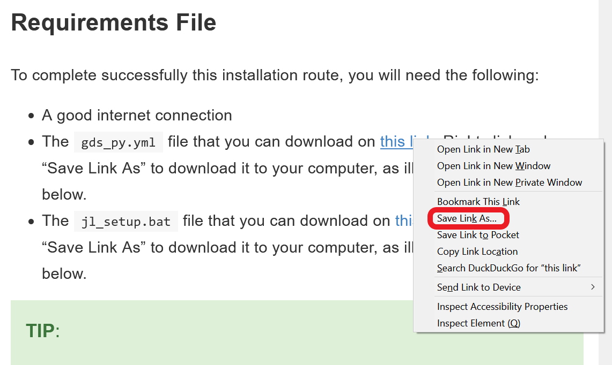
```
    
2. This will prompt a window as below. Select a destination to download it to (the Desktop, for example) and hit "Save"
    
```{r fig4b, fig.align = 'center', echo = FALSE}
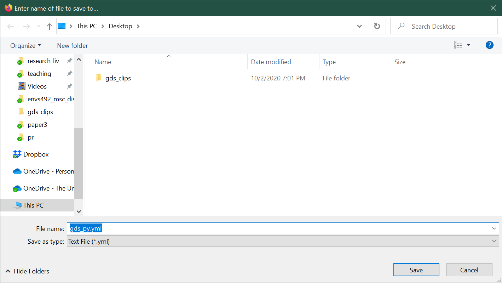
``` 
    
</div>

- A copy of Miniconda for Windows and Python 3.8. Make sure you check [which architecture of Windows you are running](#windows-arch) before proceeding.

<div class="alert alert-info" style="font-size:120%">
<b>TIP</b>: <br>

To download Miniconda, follow these steps:
    
1. Head over to the [Download Page](https://docs.conda.io/en/latest/miniconda.html#windows-installers) and select Python 3.8:
    
```{r mc1, fig.align = 'center', echo = FALSE}
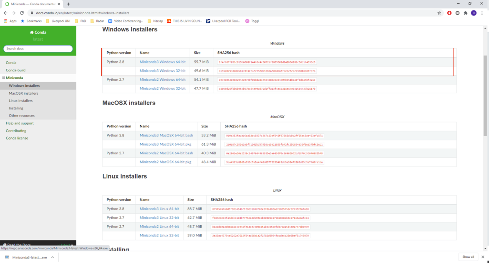
```

2. We are using **Python 3.8**, so depending on which windows version you are using (32-bit or 64-bit), click on the relevant file in the Python 3.8 section (highlighted in red). 
3. This will download the Miniconda installation file. Depending on your setup and browser, you will need to select where to place it (the Desktop folder would be a good option) or it will go straight into a default location (e.g. the Downloads folder)
    
</div>

For the sake of this guide, we will assume you download the two files (`gds_py.yml` and `jl_setup.bat`) and the Miniconda installer on the Desktop folder (`C:\Users\username\Desktop`). You do not need to choose this folder but, if you use a different one, please adjust all instructions below accordingly.


### Minicoda Install {#miniconda_install .unlisted .unnumbered}

The next step is to install the copy of Miniconda we just downloaded. To do that, follow these steps:

1. Head over to the folder where you downloaded it (the Desktop in our case)
2. Double click the downloaded file will open an installation window:

```{r inst1, fig.align = 'center', echo = FALSE}
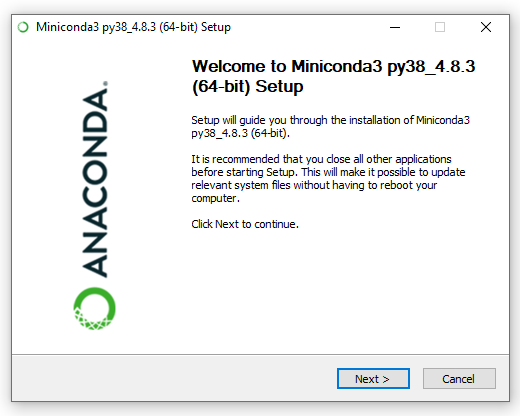
```

3. Click **_Next_** on the first step. 
4. Click **_I Agree_** to the Terms and Conditions:

```{r Inst2, fig.align = 'center', echo = FALSE}
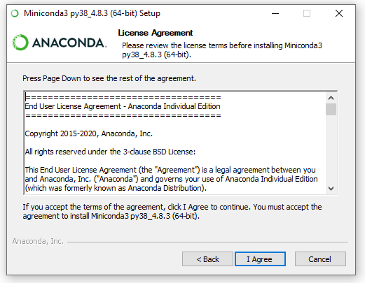
```
5. In the next window, we will select "Just Me" so no administrator rights are required:

```{r Inst_3, fig.align = 'center', echo = FALSE}
knitr::include_graphics("figs/chp4/inst_3.PNG")
```

6. The next window will ask you where to install Miniconda. Unless you know what you are doing, leave the path (highlighted in blue) as is and click next: 

```{r Inst4, fig.align = 'center', echo = FALSE}
knitr::include_graphics("figs/chp4/inst_4.PNG")
```

7. The next window can be used for an advanced setup. Unless you know what you are doing, leave the default settings as they are (ie. box ticked at _Register Miniconda3 as my default Python 3.8_).

```{r Inst_5, fig.align = 'center', echo = FALSE}
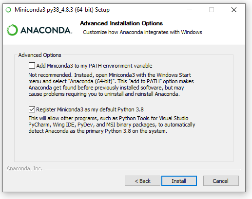
```

7. Click **_Install_** and the installation process will begin:

```{r Inst6, fig.align = 'center', echo = FALSE}
knitr::include_graphics("figs/chp4/inst_6.PNG")
```

8. Once the installation is complete, click **_Next_**.
9. Untick all boxes in the window (unless you want further information on Miniconda, which will open in your browser) and click **_Finish_**:

```{r Inst7, fig.align = 'center', echo = FALSE}
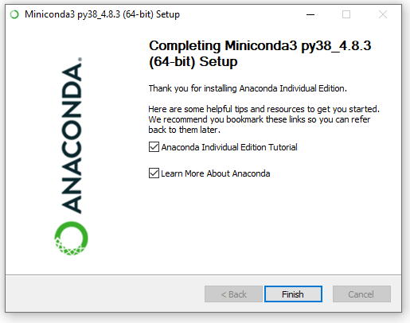
```

### Install GDS Environment {#otherWin_gds .unlisted .unnumbered}

Once we have Miniconda ready to go, the next step is to install what we will call the GDS environment. This is a set of software packages that will allow us to do very cool stuff with Python and geographic data. This is the step that will install _most_ of what you will need and hence also the longest one. Let's get started!

1. Head to the Windows icon on the bottom left of your screen and type **_Anaconda_**:

```{r fig20, fig.align = 'center', echo = FALSE}
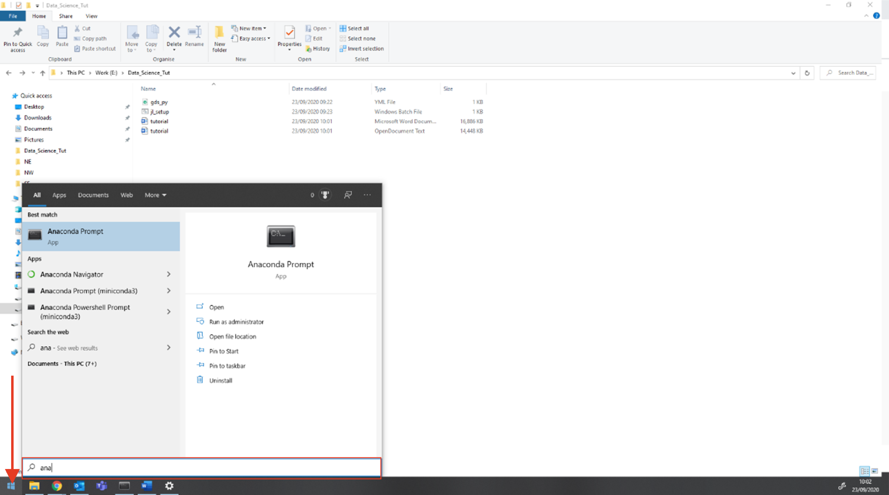
```

2. Now click on **_Anaconda Prompt (miniconda3)_** (from now on we will refer to this as the **Anaconda Prompt**)

```{r fig21, fig.align = 'center', echo = FALSE}
knitr::include_graphics("figs/chp4/Picture21.png")
```

3. This will launch a window that looks, more or less, like this:

```{r Conda1, fig.align = 'center', echo = FALSE}
knitr::include_graphics("figs/chp4/Conda_1.PNG")
```

4. Now we need to "navigate" to the folder where you placed the files downloaded above (`gds_py.yml` and `jl_setup.bat`). In this illustration, we are using the Desktop folder, so you can run the following command:

```shell
cd Desktop
```

Note that you can move to a given folder by using the command `cd myFolder` to move forward through folders, and `cd ..` to move backwards. Once you have typed the command, press _Enter_.

5. Once you have navigated to the location of your files (e.g. _Desktop_), run the following command in the Anaconda Prompt, and press enter to execute it: 

```shell
conda-env create -f gds_py.yml
```

```{r Conda4, fig.align = 'center', echo = FALSE}
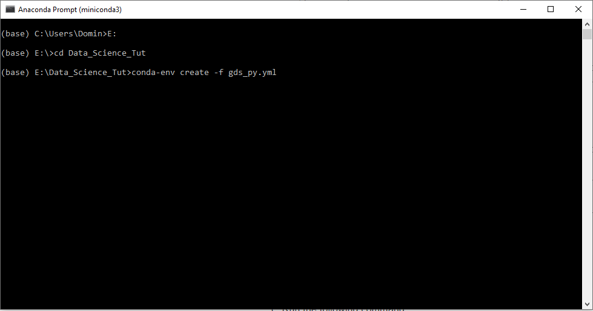
```

<div class="alert alert-info" style="font-size:120%">
<b>TIP</b>: <br>

This step requires that `gds_py.yml` exists in the folder where you have directed the Anaconda Prompt (e.g. `C:\Users\username\Downloads`) and will take a while, depending on the speed of your connection but no less than 15-20 minutes. Grab a *cuppa* and be patient!
</div>


6. If everything has gone according to plan, your Anaconda Prompt should look a bit like this:

```{r Conda7, fig.align = 'center', echo = FALSE}
knitr::include_graphics("figs/chp4/Conda_7.PNG")
```

This has created correctly the `gds` environment, congratulations! We are _almost_ there.

7. Now we need to _activate_ the environment. For this, run the following command:

```shell
conda activate gds
```

### Complete environment Setup {#otherWin_addons .unlisted .unnumbered}

The final step involves installing a few addon's that will make interacting with data a lot smoother and fun. Let's get to it!

1. Ensure you have the `gds` environment activated. You will be able to check this by looking at the name that appears in parenthesis in the beginning of the last line of the Anaconda Prompt. If yours reads `base`, activate the `gds` environment by running:

```shell
conda activate gds
```

You can see that the start of the line has changed from **(base)** to **(gds)**.

2. On this very Anaconda Prompt window, let's run the `jl_setup.bat` script. For this type the following:

```shell
jl_setup.bat
```

And hit enter. Your Anaconda Prompt should display a series of commands that looks, more or less, as follows:
 
```{r Conda9, fig.align = 'center', echo = FALSE}
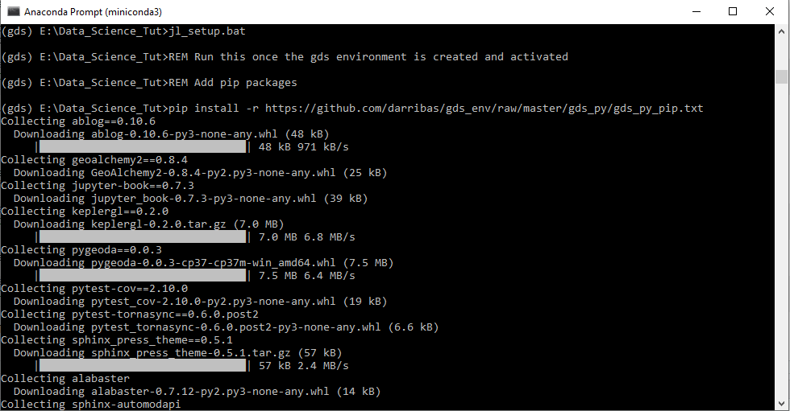
```

<div class="alert alert-info" style="font-size:120%">
<b>TIP</b>: <br>

This step requires that `jl_setup.bat` exists in the same folder `C:\Users\username\Downloads` and will also take a while, depending on the speed of your connection but no less than 10-15 minutes. Be patient, we're almost there!

</div>

When this completes, you are all set to go, congratulations!!!

**NOTE:** Do not close the Anaconda prompt yet as we will need it again in the next section, to check everything is alright. 

### Check Installation {#otherWin_check .unlisted .unnumbered}

To make sure that your installation was successful and all packages have been installed we need to run one more thing. Here're the steps to follow:

1. Download the [**check_py_stack.ipynb**](https://raw.githubusercontent.com/darribas/gds_env/master/gds_py/check_py_stack.ipynb) file by right clicking on it and selecting **_Save link as_**. Make sure to use the same folder we have been using so far.
2. From the same Anaconda Prompt as above, with the environment activated (you'll know that is the case if `(gds)` is at the top of the line in the command prompt), run:

```shell
jupyter nbconvert --to html --execute check_py_stack.ipynb
```

This will take a little bit and, if it succeeds, it will produce a file called `check_py_stack.html` that you can open in your browser to inspect. If there are no errors and every cell has been run correctly, your resulting file should look like [this one](check_py_stack.html). If the two look the same, you are all set!!!

## Running Python {#otherWin_run .unnumbered}

Now that you have successfully installed Python on your computer, you are ready to go! Now every time you want to launch the app, called Jupyter Lab, you will need to follow these steps:

1. Start by opening an Anaconda Prompt (remember: "Start Menu" --> "Anaconda Prompt (miniconda3)").
2. Navigate to the folder that you want to work in using the `cd` command (for example, your home directory: `C:\Users\username`). 
3. Activate the GDS environment by running:

```shell
conda activate gds
```

4. Launch Jupyter lab by running the following command:

```shell
jupyter lab
```

This will launch Jupyter Lab in your default browser.

<div class="alert alert-info" style="font-size:120%">
<b>TIP</b>: <br>

It is recommended to use Firefox or Chrome. 
    
If your default browser is neither of the recommended, you can:
    
1. Close the window that opens automatically
2. Open Firefox/Chrome and paste the URL from the Anaconda Prompt:

```{r Pciture24, fig.align = 'center', echo = FALSE}
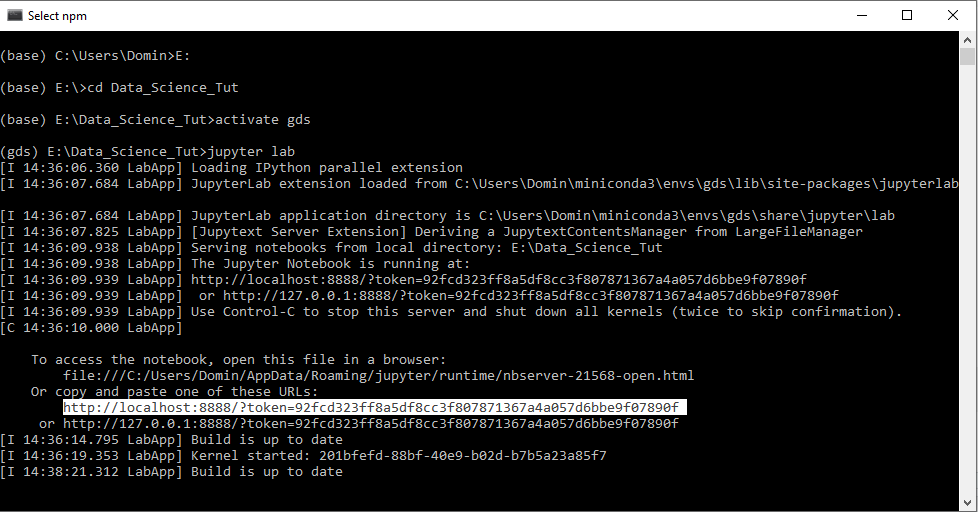
```

</div>

You should now be looking at an interface that looks very similar to this:

```{r Lab, fig.align = 'center', echo = FALSE}
knitr::include_graphics("figs/chp4/jupyter_lab.png")
```

If that is the case, CONGRATULATIONS!!! You are ready to go and start hacking away!!!

<center>

<center>

## Manual Installation {#winpro_manual_install .unnumbered}

This module has been written using the most recent version of R, RStudio. To ensure... testing testing testing.

### Download and Install R  {.unlisted .unnumbered}

#### Download R  {.unlisted .unnumbered}

R is the coding software that will execute the code you write in RStudio

**NOTE: You need to install R before you install RStudio**


```{r fig1, fig.align = 'center', echo = FALSE}
knitr::include_graphics("figs/chp4/add/Picture_1.png")
```

-  Open the [R download page](https://cran.rstudio.com/) in your browser and click on **Download R for Windows**.  

```{r fig2, fig.align = 'center', echo = FALSE}
knitr::include_graphics("figs/chp4/add/Picture_2.png")
```

-  Click on **base** (highlighted in red here) as you are installing R for the first time. 

```{r fig3, fig.align = 'center', echo = FALSE}
knitr::include_graphics("figs/chp4/add/Picture_3.png")
```

-  Click on **Download R 4.0.3 for Windows** (highlighted in red here) to start the download. 

#### Install R {.unlisted .unnumbered}

```{r fig4, fig.align = 'center', echo = FALSE}
knitr::include_graphics("figs/chp4/add/Picture_4.png")
```

-	Navigate to your **Downloads** folder and double click on the **_R-4.0.3-win_** file.

**NOTE: Once you double click on the file, a window might pop up that asks you if you want to allow this app to make changes to your device click _YES_ to continue the installation**

```{r fig5, fig.align = 'center', echo = FALSE, out.width = "350px"}
knitr::include_graphics("figs/chp4/add/R_1.png")
```

-	A new window will pop up asking you to select a language for the installation. Select **English** and click **_OK_**.

```{r fig6, fig.align = 'center', echo = FALSE, out.width = "600px"}
knitr::include_graphics("figs/chp4/add/R_2.png")
```

-	The next window shows the Terms and Conditions. Click **_Next_** to continue with the installation. 

```{r fig7, fig.align = 'center', echo = FALSE, out.width = "600px"}
knitr::include_graphics("figs/chp4/add/R_3.png")
```

-	The next window will ask you to specify where you would like to install R. Leave the default settings and click **_Next_**. 

```{r fig8, fig.align = 'center', echo = FALSE, out.width = "600px"}
knitr::include_graphics("figs/chp4/add/R_4.png")
```

-	The next window will ask you what components of R you want to install. Leave the default settings (all boxes ticked) and click **_Next_**. 


```{r fig9, fig.align = 'center', echo = FALSE, out.width = "600px"}
knitr::include_graphics("figs/chp4/add/R_5.png")
```

-	The next window will ask you if you want to customise the startup options.
- Select **No** and click **_Next_**.  

```{r fig10, fig.align = 'center', echo = FALSE, out.width = "600px"}
knitr::include_graphics("figs/chp4/add/R_6.png")
```

-	The next window will ask you to select/name a start menu folder.
- Leave the default settings (R) and click **_Next_**.  

```{r fig11, fig.align = 'center', echo = FALSE, out.width = "600px"}
knitr::include_graphics("figs/chp4/add/R_7.png")
```

-	The next window will ask you to select additional task that will be performed while installing R.
- Leave the default (Additional shortcuts unticked,Registry entries ticked) and click **_Next_** .

```{r fig12, fig.align = 'center', echo = FALSE, out.width = "600px"}
knitr::include_graphics("figs/chp4/add/R_8.png")
```

-	R will now install.

```{r fig13, fig.align = 'center', echo = FALSE, out.width = "600px"}
knitr::include_graphics("figs/chp4/add/R_9.png")
```

-	Once the installation is complete, click **_Finish_**. 


### Download and Install RStudio  {.unlisted .unnumbered}

#### Download RStudio  {.unlisted .unnumbered}

R-Studio is the R user interface in which you can code. 

```{r fig14, fig.align = 'center', echo = FALSE}
knitr::include_graphics("figs/chp4/add/Studio_1.png")
```

- Go to the [R-studio download page](https://rstudio.com/products/rstudio/download/).

```{r fig15, fig.align = 'center', echo = FALSE}
knitr::include_graphics("figs/chp4/add/Studio_2.png")
```

- On the download page, scroll down and click on the **_Download_** button under **RStudio Desktop**. 


```{r fig16, fig.align = 'center', echo = FALSE}
knitr::include_graphics("figs/chp4/add/Studio_3.png")
```

- Click on **Download RStudio for Windows** to download the installation file 

#### Install RStudio  {.unlisted .unnumbered}

```{r fig17, fig.align = 'center', echo = FALSE}
knitr::include_graphics("figs/chp4/add/Studio_4.png")
```

-	Navigate to your **Downloads** folder and double click on the **RStudio-1.4.1103** file.  
**NOTE: Once you double click on the file, a window might pop up that asks you if you want to allow this app to make changes to your device click _YES_ to continue the installation**

```{r fig18, fig.align = 'center', echo = FALSE, out.width = "600px"}
knitr::include_graphics("figs/chp4/add/Studio_5.png")
```

-	In the installation window that opens, click **_Next_**.

```{r fig19, fig.align = 'center', echo = FALSE, out.width = "600px"}
knitr::include_graphics("figs/chp4/add/Studio_6.png")
```

- In the next window, you can specify where you want to install RStudio.
- Leave the default settings and click **_Next_**. 


```{r fig20_dupl, fig.align = 'center', echo = FALSE, out.width = "600px"}
knitr::include_graphics("figs/chp4/add/Studio_7.png")
```

-	The next window will ask you to choose a Start Menu Folder.
- Leave the default settings (RStudio) and click **_Next_**.


```{r fig21_dpl, fig.align = 'center', echo = FALSE, out.width = "600px"}
knitr::include_graphics("figs/chp4/add/Studio_8.png")
```

-	RStudio is now installing. 


```{r fig22, fig.align = 'center', echo = FALSE, out.width = "600px"}
knitr::include_graphics("figs/chp4/add/Studio_9.png")
```

-	Once the intallation is completed, click on **_Finish_**.

### Open RStudio  {.unlisted .unnumbered}
```{r Inst23, fig.align = 'center', echo = FALSE}
knitr::include_graphics("figs/chp4/add/Studio_10.png")
```

- To open RStudio, click on the Windows logo in the left bottom corner of your screen and either type **_RStudio_** or look for the **RStudio folder** in the menu. 
- Double click on Rstudio to open it. 

<center>
**CONGRATULATIONS YOU HAVE NOW SUCCESFULLY INSTALLED R and Rstudio**

**You can now start coding**


