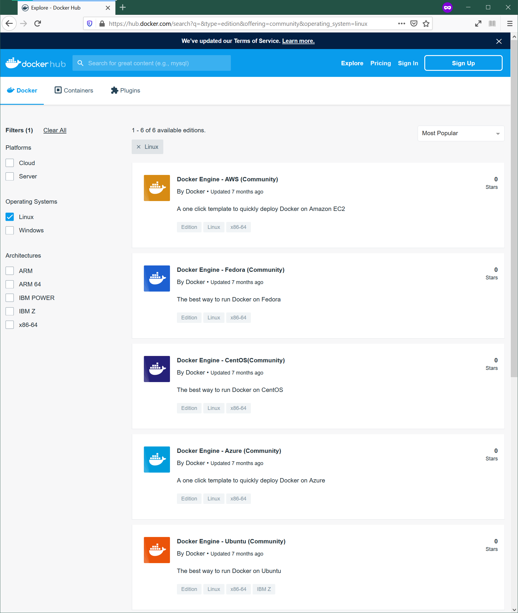
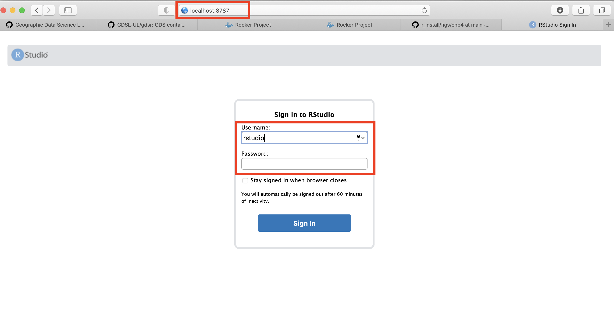
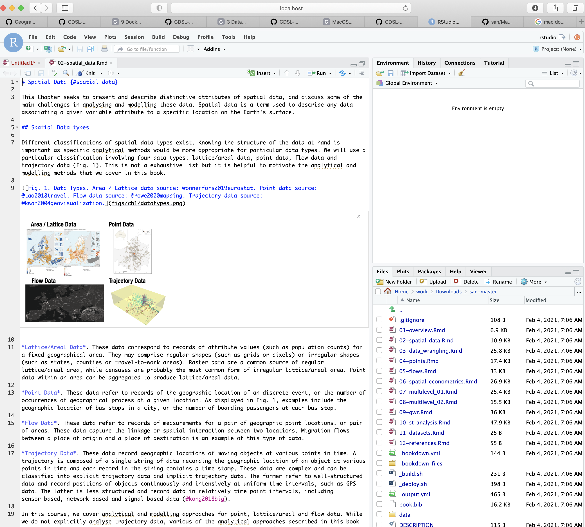
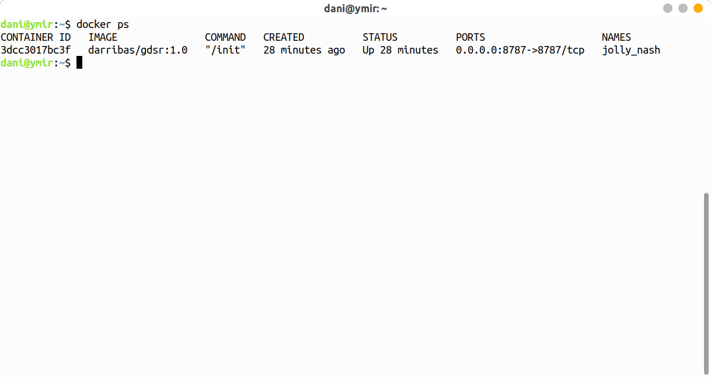

# Linux Installation {#linux .unnumbered}

<div class="alert alert-info" style="font-size:120%">
<b>NOTE</b>: <br>

This guide shows you how to install on Linux via the `gdsr`

</div>


## Installation {#linux_install .unnumbered}

### Requirements {.unlisted .unnumbered}

To be able to complete this guide, your machine will need to meet the following requirements:

1. A stable internet connection
2. ~10GB of space on your hard drive
3. A Linux distribution supported by Docker. You can check available distributions for ready installation on [this page](https://hub.docker.com/search?q=&type=edition&offering=community&operating_system=linux).

**NOTE** If you are running a different distribution (e.g. Arch Linux), there is a good chance Docker _will_ work, but you will have to source your own instructions for installation. Once you have Docker up and running on your machine, you can move to [Installing the GDSR environment].

### Docker install steps {.unlisted .unnumbered}

1. Select the page for your distribution from the [Docker Hub list of supported distributions](https://hub.docker.com/search?q=&type=edition&offering=community&operating_system=linux)


<br>

For this example, we will use Ubuntu.

2. Make sure that you meet the requirements to install Docker:


<br>

3. Follow the steps specified on the official install guide:

> [https://docs.docker.com/engine/install/ubuntu/](https://docs.docker.com/engine/install/ubuntu/)

Once you complete these steps successfully, you will have Docker ready to go on your computer, congratulations!

### Installing the GDSR environment {.unlisted .unnumbered}

Once you have Docker installed and running on your machine, installing everything you need to run Python and associated libraries boils down to the following two steps:

1. Open your terminal app of choice (for example, Gnome Terminal)
2. Run the following command:

```shell
docker pull darribas/gdsr:1.0
```


<br>

You will know this has completed when each line says 'Pull complete'.

<div class="alert alert-info" style="font-size:120%">
<b>IMPORTANT</b>: <br>
    
Make sure you are connected to the internet and it is a stable connection. This step involves the download of large amounts of data (ca. 10GB) so it might take a while. However, it only needs to be run once.
   
</div>

### Check success {.unlisted .unnumbered}

If everything has gone according to plan, you should see `darribas/gdsr:1.0` show up on your terminal when you type `docker image ls` (note in the image below there are other containers that are not required, do not worry if you don't have those or slightly different values on the ID and the "CREATED" columns, the important bit is having `darribas/gdsr:1.0` listed):


<br>

## Running RStudio {#linux_run .unnumbered}

The following sections cover how to spin up the container you have just installed, use it, and shut it down when you are done.

### Running the container {.unlisted .unnumbered}

To start up RStudio through Docker, follow these steps:

1. In a new terminal line, type the following command to run the container and hit enter: 

```shell
docker run -d -e PASSWORD=test123 -p 8787:8787 -v "${PWD}":/home/rstudio/work darribas/gdsr:1.0
```


<br>

You have now started a RStudio session. 

2. To access this session go to your chosen web browser (e.g. Firefox/Chrome) and type: `localhost:8787` into the search bar

<br>



3. The page that loads will prompt you for a password. Type the following, as on the figure above:

- Username: `rstudio`
- Password: `test123`


4. Now you are in RStudio, you can start coding or opening a new file. Please refer to  [Rowe and Arribas-Bel (2021)](https://gdsl-ul.github.io/san/data-wrangling.html#introducing-r) for an introduction to the RStudio interface, R Script and R Notebook.


<br>

### Using a R Notebook {.unlisted .unnumbered}

- A R notebook is where you will run your code and can add text. The top header is called `YAML metadata` and each shaded box is called a kernel (or code chunk) contained within delimiters ` ```{r}` and ` ``` `.

- Type `1 + 1` into a code chunk. To run the code click the play icon as indicated below. 


<br>

<div class="alert alert-info" style="font-size:120%">
<b>IMPORTANT</b>: <br>
    
Make sure you save your files by  you want to keep **ONLY** _within_ the `work` folder, as this will ensure they are saved on your machine.
    
Everything saved outside the `work` folder will be _destroyed_ as soon as you shut down the session.
   
</div>


- You can access other files on your machine through the `work` folder in the Files Browser. From here you can navigate to your Documents and designated folder for this module. 





Here I am navigating to the san folder that we have created for this module in my Downloads. You can replace this with the pathway to the folder you create for this module.

<br>

- You can save your notebook here using **File** > **Save As**


<br>

- And you can create new folders to organise your work


<br>

### Ending your session {.unlisted .unnumbered}

Once you have finished in your RStudio session and have saved all your work, you can end the session by closing your browser.

1) Run `docker ps`:



2) Then, type `docker container rm` and copy the *CONTAINER ID* from the output above as shown here:


<br>

You can now safely shut the terminal window.

<br>

Next time you go to run a R Notebook you will NOT need to repeat the whole process as you have already installed Docker and the GDSR environment. Instead you can start from [Running the container](#linux_run) and carry on from there.
