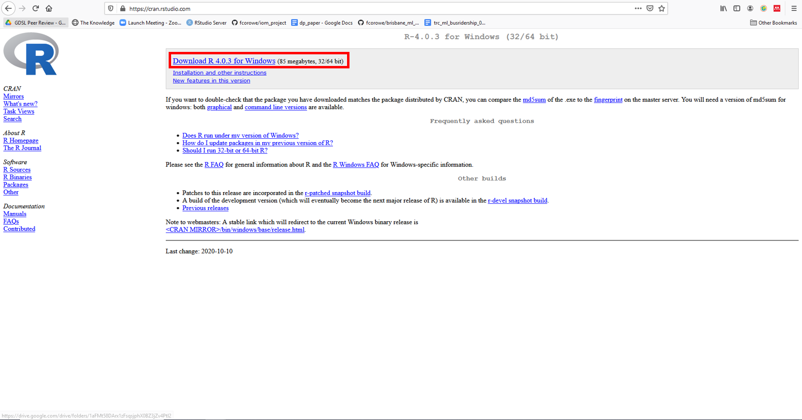
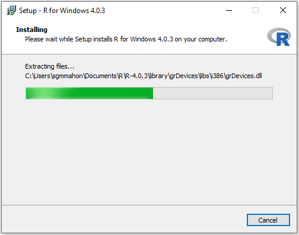
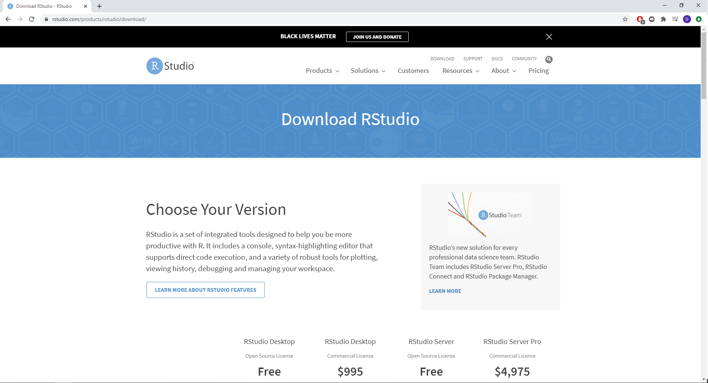
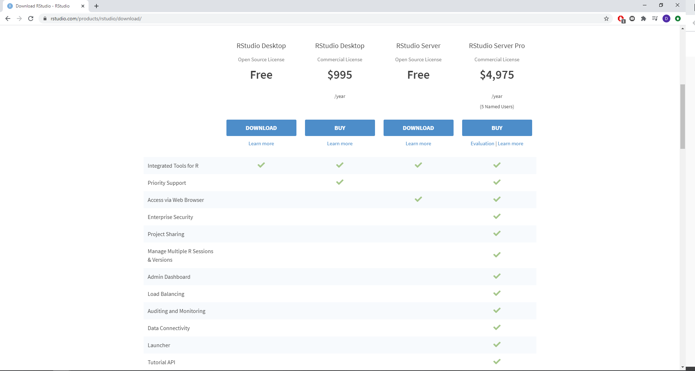
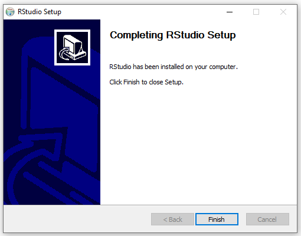

# Windows 10 Home/pre-10 {#otherWin .unnumbered}

This guide covers the installation of R and RStudio on machines running Windows 10 Home Edition or versions of Windows prior to Windows 10 (e.g. Windows 7). With this approach, you will install R and RStudio "natively", that is running directly on your operating system. If you are not sure what version of Windows you are running, check out this [guide](#windows-version).

<div class="alert alert-danger" style="font-size:120%">
<b>IMPORTANT</b>: <br>
    
This module has been written using the most up-to-date versions of R, RStudio and relevant packages. To avoid software compatibility issues it is important you have these same versions installed on your home computer.

**Therefore, if you have R or RStudio already installed on your computer, please first uninstall them unsing the instructions [here](#uninstall_otherwin).**
    
</div>


## Download and Install R  {.unlisted .unnumbered}

### Download R  {.unlisted .unnumbered}

R is the coding software that will execute the code you write in RStudio.

**NOTE: You need to install R before you install RStudio**


-  Open the [R download page](https://cran.rstudio.com/) in your browser and click on **Download R for Windows**.  


-  Click on **base** (highlighted in red here) as you are installing R for the first time. 



-  Click on **Download R 4.0.3 for Windows** (highlighted in red here) to start the download. 

### Install R {.unlisted .unnumbered}


-	Navigate to your **Downloads** folder and double click on the **_R-4.0.3-win_** file.

**NOTE: Once you double click on the file, a window might pop up that asks you if you want to allow this app to make changes to your device click _YES_ to continue the installation**


-	A new window will pop up asking you to select a language for the installation. Select **English** and click **_OK_**.


-	The next window shows the Terms and Conditions. Click **_Next_** to continue with the installation. 


-	The next window will ask you to specify where you would like to install R. Leave the default settings and click **_Next_**. 


-	The next window will ask you what components of R you want to install. Leave the default settings (all boxes ticked) and click **_Next_**. 


-	The next window will ask you if you want to customise the startup options.
- Select **No** and click **_Next_**.  


-	The next window will ask you to select/name a start menu folder.
- Leave the default settings (R) and click **_Next_**.  


-	The next window will ask you to select additional task that will be performed while installing R.
- Leave the default (Additional shortcuts unticked,Registry entries ticked) and click **_Next_** .



-	R will now install.


-	Once the installation is complete, click **_Finish_**. 


## Download and Install RStudio  {.unlisted .unnumbered}

### Download RStudio  {.unlisted .unnumbered}

R-Studio is the R user interface in which you can code. 



- Go to the [R-studio download page](https://rstudio.com/products/rstudio/download/).



- On the download page, scroll down and click on the **_Download_** button under **RStudio Desktop**. 


- Click on **Download RStudio for Windows** to download the installation file 

### Install RStudio  {.unlisted .unnumbered}


-	Navigate to your **Downloads** folder and double click on the **RStudio-1.4.1103** file.  
**NOTE: Once you double click on the file, a window might pop up that asks you if you want to allow this app to make changes to your device click _YES_ to continue the installation**


-	In the installation window that opens, click **_Next_**.


- In the next window, you can specify where you want to install RStudio.
- Leave the default settings and click **_Next_**. 


-	The next window will ask you to choose a Start Menu Folder.
- Leave the default settings (RStudio) and click **_Next_**.


-	RStudio is now installing. 




-	Once the intallation is completed, click on **_Finish_**.

## Open RStudio  {.unlisted .unnumbered}


- To open RStudio, click on the Windows logo in the left bottom corner of your screen and either type **_RStudio_** or look for the **RStudio folder** in the menu. 
- Double click on Rstudio to open it. 

<center>

## Install Packages  {.unlisted .unnumbered}

In order to complete the course, you will need to have installed all the required packages. The simplest way to do this is to run the below code in RStudio.


```r
list.of.packages.cran <- c(
  "arm", "car", "corrplot", "FRK", "gghighlight",
  "ggplot2", "ggmap", "GISTools", "gridExtra", "gstat",
  "jtools", "kableExtra", "knitr", "lme4", "lmtest",
  "lubridate", "MASS", "merTools", "plyr", "RColorBrewer",
  "rgdal", "sf", "sjPlot", "sp", "spgwr",
  "spatialreg", "spacetime", "stargazer", "tidyverse", "tmap",
  "viridis", "tufte"
)

new.packages.cran <- list.of.packages.cran[!(list.of.packages.cran %in% installed.packages()[,"Package"])]
if(length(new.packages.cran)) install.packages(new.packages.cran)

for(i in 1:length(list.of.packages.cran)) {
  library(list.of.packages.cran[i], character.only = T)
}
```

- Copy the code above by clicking the button to the top right of the code chunk which says **Copy to clipboard** when you hover over it.


- Open _RStudio_ and click the image of a _'white and green plus sign on top of a white square'_ that says **New File** when you hover over it. Then, from the drop-down menu that appears, click on the option **R Script**.


- A new window with a blank background and the heading **_Untitled1_** (indicated by red arrow above) should appear. 

- Paste the copied code into this window by right-clicking and selecting **Paste**.


- Click on the **Code** menu at the top of the screen. Select **Run Region** from the drop-down menu, then click **Run All** from the second drop-down menu.

- This should install all the packages you need to complete the ‘Spatial Modelling for Data Scientists’ module.

<div class="alert alert-success" style="font-size:120%">
<b>NOTE</b>: <br>
    
The script will install several dozen packages on your computer. This could take around 20-30 minutes to complete, depending on you computer and bandwidth.
   
</div>


- Once the code has finished running, a blue arrow with a gray vertical line next to it (indicated by red arrow above) will appear at the bottom of the _Console_ window at the bottom left of the screen. This means R has finished the task it was given and is ready for it's next command.


- You can now close the _R Script_ file you created by clicking on the `x` next to the header **_Untitled1_** (indicated by red arrow above). You do not need to save the file.

<br>

<div class="alert alert-success" style="font-size:120%">

Congratulations!!! You have now successfully installed R, RStudio and all packages required to complete the course!

You can now start coding.

</div>


<br>

## Uninstall R and RStudio {#uninstall_otherwin .unnumbered}

This section shows how to uninstall programs on Windows 10 Home Edition. You only need to read this section if you have an older version of R or RStudio already installed on your computer.


- Right click on the Windows logo in the left bottom corner of your screen and click on **Settings**.


- At the _Settings_ menu, click on **Apps**.


- This should take you to a page called _Apps & features_, where you can select programs to uninstall. Scroll down until you see any program relating to R or RStudio (in this case 'R 3.6.1', RStudio and 'Rtools version 3.5').

- Click on the program you wish to uninstall and select **Uninstall**.

**NOTE: Once you click Uninstall, a window might pop up that asks you if you want to allow this app to make changes to your device click _YES_ to continue.**


- You will then be asked whether you are sure you want to remove the program. Click **Yes**.


-	The program is now uninstalling.


- Once this is complete, you will get a message confirming that the installation was successful. Click **OK**.

<br>

**CONGRATULATIONS YOU HAVE NOW SUCCESFULLY UNINSTALLED THE PROGRAM!**

**Make sure to repeat this process until all programs relating to R (i.e. R, RStudio and Rtools) have been uninstalled from your machine.**
