--- 
title: "R Installation Guide"
author: "Francisco Rowe, Dani Arribas-Bel"
date: "2021-02-04"
site: bookdown::bookdown_site
output: bookdown::gitbook
documentclass: book
bibliography: [book.bib, packages.bib]
biblio-style: apalike
link-citations: yes
github-repo: GDSL-UL/r_install
description: "Installation Guide for R"
---

# Purpose {.unnumbered}

This resource provides step-by-step descriptions on how to install and run RStudio for 'Spatial Modelling for Data Scientists' from your own computer.

Select your Operating System and follow the steps.


<mark> **A1** [MacOS Installation](#macos) </mark>

<mark> **A2** [Linux Installation](#linux) </mark>

<mark> **A3** [Windows 10 Pro/Education](#win10pro) </mark>

<mark> **A4** [Windows 10 Home/pre-10](#otherWin) </mark>

*Need to find out your Windows version?* Click [HERE](windows-version.html)

<a rel="license" href="http://creativecommons.org/licenses/by-sa/4.0/"></a><br />This work is licensed under a <a rel="license" href="http://creativecommons.org/licenses/by-sa/4.0/">Creative Commons Attribution-ShareAlike 4.0 International License</a>.

<!--chapter:end:index.Rmd-->

# MacOS Installation {#macos .unnumbered}

<div class="alert alert-info" style="font-size:120%">
<b>NOTE</b>: <br>

This guide shows you how to install on MacOS via the `gdsr`

</div>

## Installation {.unnumbered}

### Requirements {.unlisted .unnumbered}

To be able to complete this guide, your machine will need to meet the following requirements:

1. A stable internet connection
2. ~10GB of space on your hard drive
3. MacOS version 10.13 or newer i.e. High Sierra, Mojave, Catalina or Big Sur. If you are unsure what version you are running click on the Apple icon in the top left of the screen and then **About this Mac**.
4. Mac hardware must be a 2010 model or newer

### Docker install steps {.unlisted .unnumbered}

1. Go to the [dockerhub website](https://hub.docker.com/editions/community/docker-ce-desktop-mac/).
2. Ensure you meet the criteria for download (it is the same as stated above) and then select 'Get Docker' button.


<br>

3. This will then download to your machine but may take some time. Once finished, to access this download go to **Finder** > **Downloads** > **Docker.dmg** and double click.

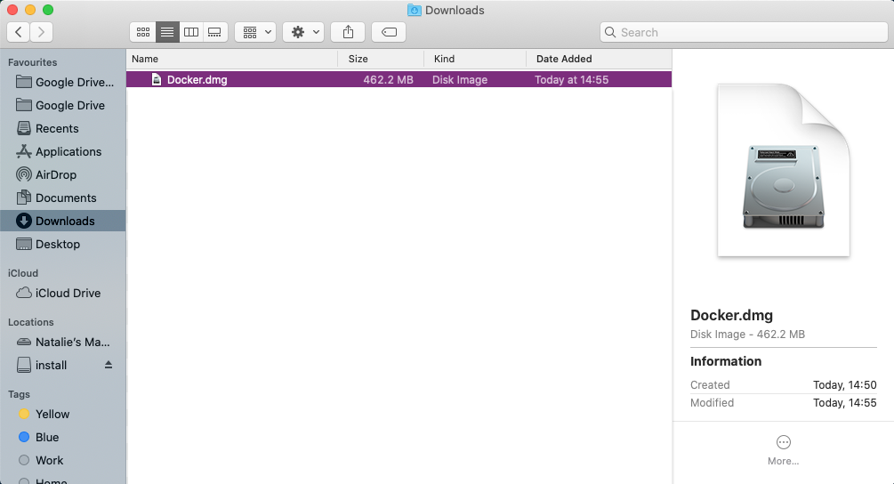

<br>

4. You should then be prompted to drag and drop this application into the applications folder like so:


You may get further windows asking for access to the program. To these you can click **Open** > **OK** > enter your account password and click **Install helper**

<br>


5. After you have done this, the whale icon should now show in your taskbar:


<br>

You have successfully downloaded Docker!

### Using Docker {.unlisted .unnumbered}

Now we have Docker installed we can use it to access Python and all the associated packages we need for the practicals

### Installing the GDSR environment {.unlisted .unnumbered}

1. Access your terminal: **Launchpad** > **Other** > **Terminal**
2. In a fresh line in the terminal type the following to install the GDSR environment container: 

```shell
docker pull darribas/gdsr:1.0alpha
```

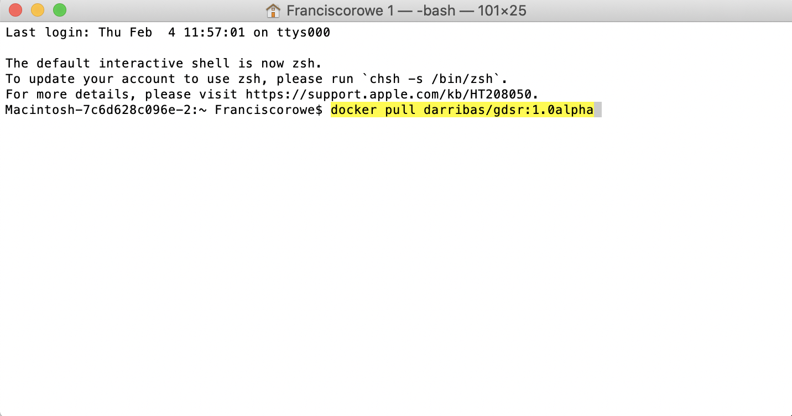

<br>

3. This should now prompt a long download process that looks a bit like this:

Don't be alarmed if it seems to take a very long time.

<div class="alert alert-info" style="font-size:120%">
<b>IMPORTANT</b>: <br>
    
Make sure you are connected to the internet and it is a stable connection. This step involves the download of large amounts of data (ca. 5.5GB) so it might take a while. However, it only needs to be run once.
   
</div>

### Check success {.unlisted .unnumbered}

You will know the process has completed successfully when each line says *'Pull complete'* and the new line shows your machine name.

If everything has gone according to plan, you should see `darribas/gdsr:1.0alpha` show up on your terminal when you type `docker image ls` (**NOTE** in the image below there are other containers that are not required, do not worry if you don't have those or slightly different values on the ID and the "CREATED" columns, the important bit is having `darribas/gdsr:1.0alpha` listed):


<br>

## Running RStudio {.unnumbered}

The following sections cover how to spin up a session you have just installed, use it, and shut it down when you are done.

### Running the container {.unlisted .unnumbered}

1. In the new terminal line, type the following command to run the container: 

`docker run -d -e PASSWORD=test123 -p 8787:8787 -v "${PWD}":/home/rstudio/work darribas/gdsr:1.0alpha`


<br>

You have now started a RStudio session. 

<div class="alert alert-info" style="font-size:120%">
<b>IMPORTANT</b>: <br>
    
Please do NOT close the terminal window until you are finished in this RStudio session
   
</div>

2. The following window will appear (If this doesn't happen, go to 5):

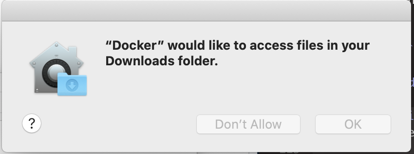

3. Go to *`System Preferences'* > *`Security & Privacy'*. The following window will appear:

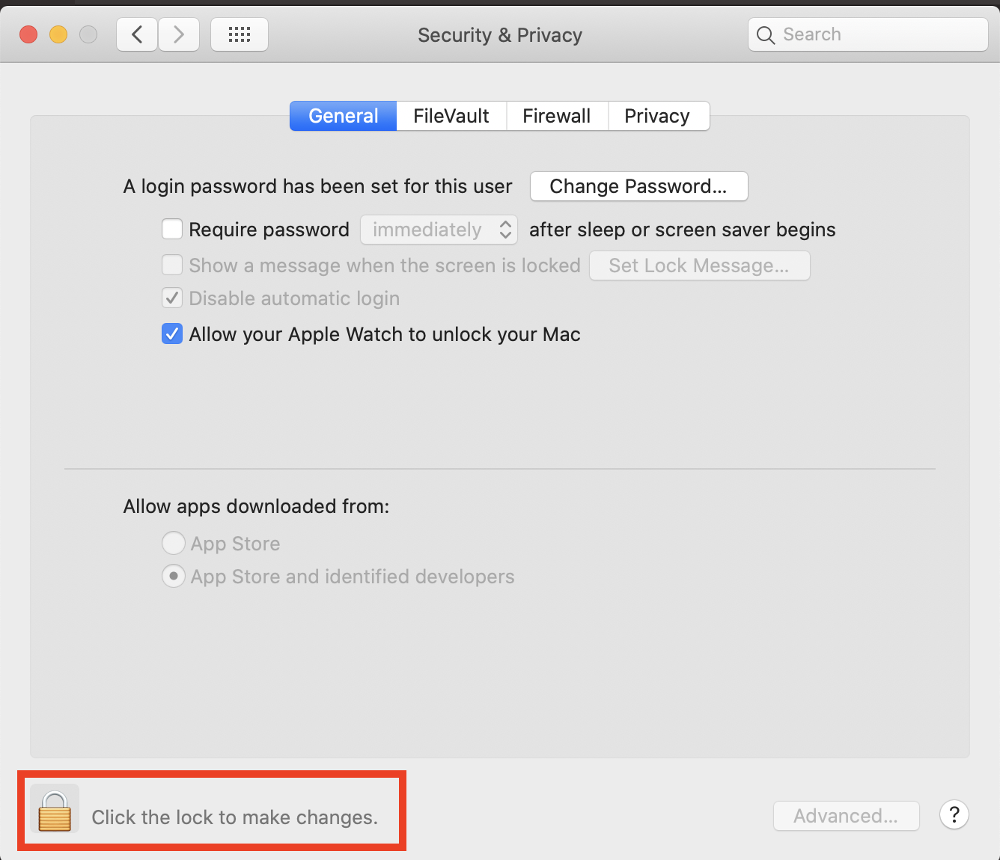

4. Enter your password.

5. Now you can access the RStudio session. Go to your chosen web browser (e.g. Safari/Chrome) and type: `localhost:8787` into the search bar


6. The page that loads will prompt you for a username and password as shown above. Type the following (as on the figure above):

`username: rstudio` 

`password: test123`

<br>

7. Now you are in RStudio Server, you can start coding or opening a new file. Please refer to [Rowe and Arribas-Bel (2021)](https://gdsl-ul.github.io/san/data-wrangling.html#introducing-r) for an introduction to the RStudio interface, R Script and R Notebook.


<br>

### Using a R Notebook {.unlisted .unnumbered}

- A R notebook is where you will run your code and can add text. The top header is called `YAML metadata` and each shaded box is called a kernel (or code chunk) contained within delimiters ` ```{r}` and ` ``` `.

- Type `1 + 1` into a code chunk. To run the code click the play icon as indicated below. 

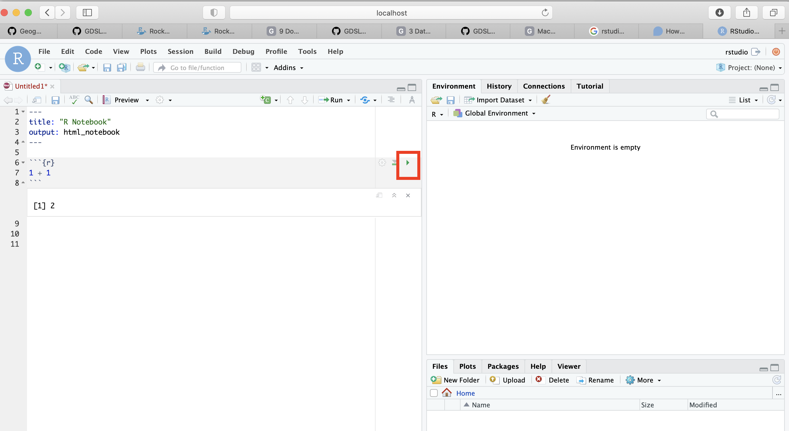

<br>

<div class="alert alert-info" style="font-size:120%">
<b>IMPORTANT</b>: <br>
    
Make sure you save your files by  you want to keep **ONLY** _within_ the `work` folder, as this will ensure they are saved on your machine.
    
Everything saved outside the `work` folder will be _destroyed_ as soon as you shut down the session.
   
</div>


- You can access other files on your machine through the `work` folder in the Files Browser. From here you can navigate to your Documents and designated folder for this module. 

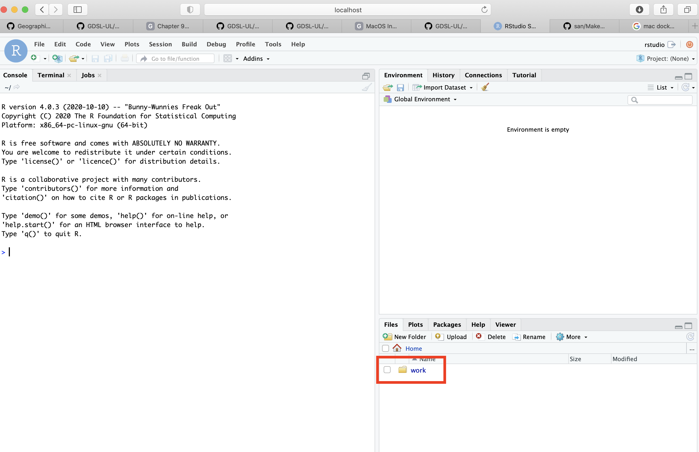

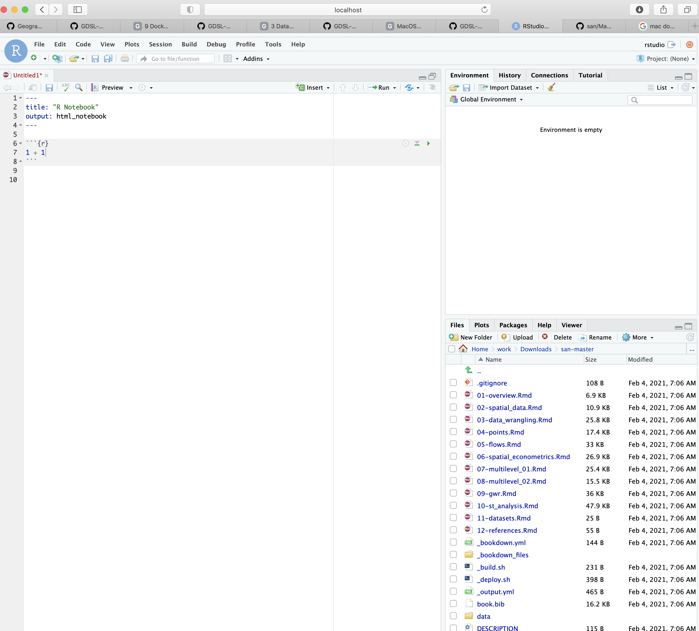


Here I am navigating to the san folder that we have created for this module in my Downloads. You can replace this with the pathway to the folder you create for this module.

<br>

- You can save your notebook here using **File** > **Save As**


<br>

- And you can create new folders to organise your work


<br>

### Ending your session {.unlisted .unnumbered}
Once you have finished in your RStudio session and have saved all your work, you can end the session by closing your browser.

1) Run `docker ps`:


2) Then, type `docker container stop` and copy the *CONTAINER ID* from the output above as shown here:


<br>

You can now safely shut the terminal window.

<br>

Next time you go to run a R Notebook you will NOT need to repeat the whole process as you have already installed Docker and the GDSR environment. Instead you can start from [Running the container] and carry on from there.

<!--chapter:end:01-mac.Rmd-->

# Linux Installation {#linux .unnumbered}

**NOTE** This guide shows you how to install on Linux via the `gds_env` [@gds_env]

## Installation {#linux_install .unnumbered}

### Requirements {.unlisted .unnumbered}

To be able to complete this guide, your machine will need to meet the following requirements:

1. A stable internet connection
2. ~10GB of space on your hard drive
3. A Linux distribution supported by Docker. You can check available distributions for ready installation on [this page](https://hub.docker.com/search?q=&type=edition&offering=community&operating_system=linux).

**NOTE** If you are running a different distribution (e.g. Arch Linux), there is a good chance Docker _will_ work, but you will have to source your own instructions for installation. Once you have Docker up and running on your machine, you can move to [Installing the GDS container].

### Docker install steps {.unlisted .unnumbered}

1. Select the page for your distribution from the [Docker Hub list of supported distributions](https://hub.docker.com/search?q=&type=edition&offering=community&operating_system=linux)


<br>

For this example, we will use Ubuntu.

2. Make sure that you meet the requirements to install Docker:

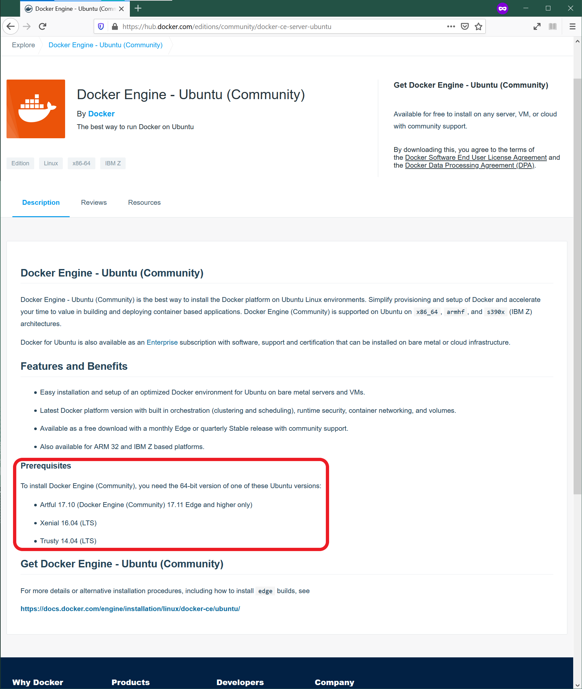
<br>

3. Follow the steps specified on the official install guide:

> [https://docs.docker.com/engine/install/ubuntu/](https://docs.docker.com/engine/install/ubuntu/)

Once you complete these steps successfully, you will have Docker ready to go on your computer, congratulations!

### Installing the GDS container {.unlisted .unnumbered}

Once you have Docker installed and running on your machine, installing everything you need to run Python and associated libraries boils down to the following two steps:

1. Open your terminal app of choice (for example, Gnome Terminal)
2. Run the following command:

```shell
docker pull darribas/gds:5.0
```


<br>

You will know this has completed when each line says 'Pull complete'.

<div class="alert alert-info" style="font-size:120%">
<b>IMPORTANT</b>: <br>
    
Make sure you are connected to the internet and it is a stable connection. This step involves the download of large amounts of data (ca. 10GB) so it might take a while. However, it only needs to be run once.
   
</div>

### Check success {.unlisted .unnumbered}

If everything has gone according to plan, you should see `darribas/gds:5.0` show up on your terminal when you type `docker image ls` (note in the image below there are other containers that are not required, do not worry if you don't have those or slightly different values on the ID and the "CREATED" columns, the important bit is having `darribas/gds:5.0` listed):

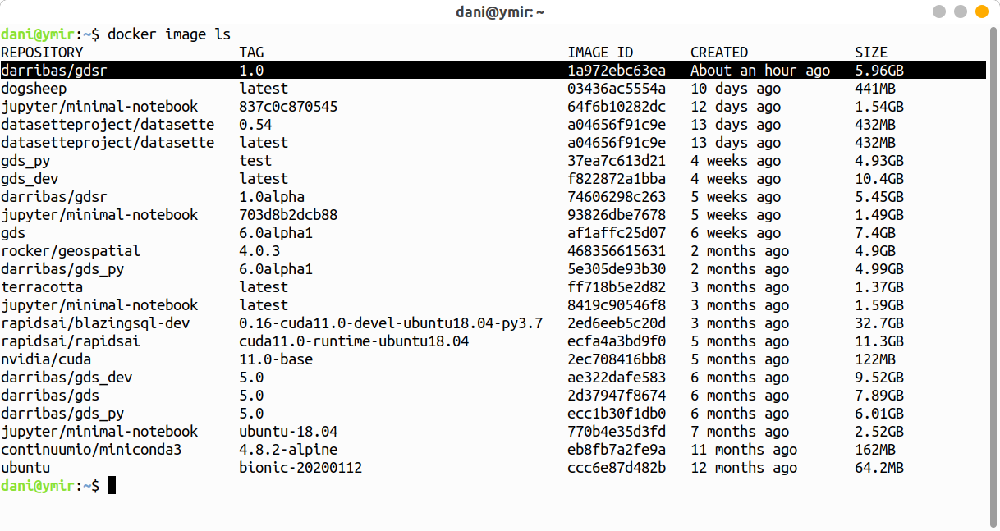
<br>

## Running Python {#linux_run .unnumbered}

The following sections cover how to spin up the container you have just installed, use it, and shut it down when you are done.

### Running the container {.unlisted .unnumbered}

To start up Python through Docker, follow these steps:

1. In a new terminal line, type the following command to run the container and hit enter: 

```shell
docker run --rm -ti -p 8888:8888 -v ${PWD}:/home/jovyan/work darribas/gds:5.0
```

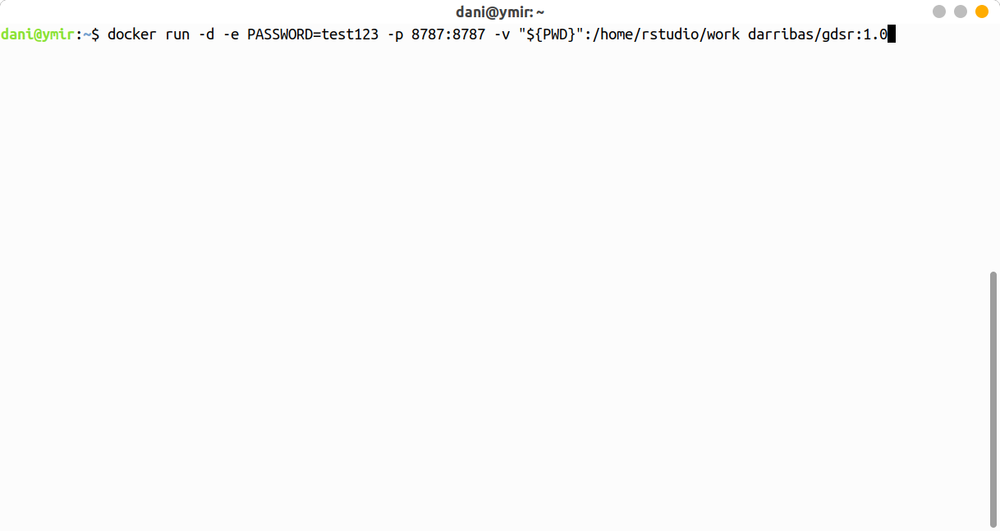

<br>

You have now started a Python session. 


<div class="alert alert-info" style="font-size:120%">
<b>IMPORTANT</b>: <br>
    
Please do NOT close the terminal window until you are finished in this Python session
   
</div>

2. To access this session go to your chosen web browser (e.g. Firefox/Chrome) and type: `localhost:8888` into the search bar

<br>


3. The page that loads will prompt you for a password or a token. This can be found in the text in the terminal following the last command you ran (step 9). A long series of numbers and letters will be preceded by `?token=`. Copy this long series of characters and paste into the password box in your browser.

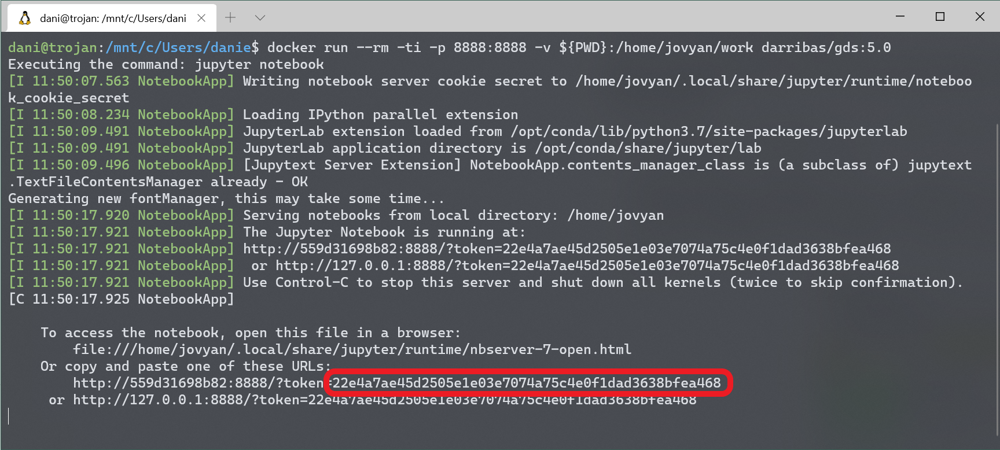


4. Now you are in Jupyter Lab you can open up a Python 3 notebook


<br>

### Using Jupyter Notebook {.unlisted .unnumbered}

- This notebook is where you will run your code. Each shaded box is called a kernel. To test this out you can type `print('test')` into one of these kernels. To run the code use the shortcut `Ctrl + Enter`.


<br>

<div class="alert alert-info" style="font-size:120%">
<b>IMPORTANT</b>: <br>
    
Make sure you save files you want to keep **ONLY** _within_ the `work` folder, as this will ensure they are saved on your machine.
    
Everything saved outside the `work` folder will be _destroyed_ as soon as you shut down the session.
   
</div>

- You can save your notebook using **File** > **Save notebook as**


<br>

- You can create new folders to organise your work


<br>

- And you can access other files on your machine through the 'work' folder in the File Browser. From here you can navigate to your Documents and designated folder for this module


<br>

### Ending your session {.unlisted .unnumbered}

Once you have finished in your Jupyter session and have saved all your work, you can end the session from the terminal.

Using `Ctrl + C` will prompt a `y/n` option. Either type `y` or `Ctrl + C` again to end the session. 


<br>

You can now safely shut the terminal window.

<br>

Next time you go to run a Jupyter Notebook you will not need to repeat the whole process as you have already installed Docker and the GDS environment. Instead you can start from [Running Python through Docker] and carry on from there.

<!--chapter:end:02-linux.Rmd-->

# Windows 10 Pro/Education {#win10pro .unnumbered}

This guide shows you how to install Docker and run R/RStudio virtually using an environment we have created called `darribas/gdsr:1.0alpha` [@gds_env]. This approach is preferred for anyone using 'Windows 10 Pro/Education' because it avoids potential compatibility issues between the latest versions of R/RStudio and other software on your computer. 

**Please therefore follow these steps even if R/RStudio is already installed on your computer.**

<br>

## Installing Docker {.unlisted .unnumbered}

### Requirements {.unlisted .unnumbered}

To be able to complete this guide, your machine will need to meet the following requirements:

1. A stable internet connection
2. ~10GB of space on your hard drive
3. Windows 10 64-bit: Pro, Enterprise, or Education (Build 16299 or later). You can see the full requirements on the official [Docker for Windows page](https://docs.docker.com/docker-for-windows/install/).

<div class="alert alert-danger" style="font-size:120%">
<b>IMPORTANT</b>: <br>
    
If you are not sure what version of Windows you are running, check out this [guide](#windows-version).
    
If you know you don't have Windows 10 Pro, for example you are running Windows 10 Home, please use [this install/run guide](#otherWin).
    
</div>
 
### Docker install steps {#winpro_docker_install_steps .unlisted .unnumbered}

Once you have everything required ready to go, the first step is to install the Docker Desktop App for Windows. Here are the steps you can follow:

1. Head over to Docker Hub to download a copy of Docker for Windows:

> [https://hub.docker.com/editions/community/docker-ce-desktop-windows/](https://hub.docker.com/editions/community/docker-ce-desktop-windows/)


<br>

2. Download a copy of the Docker Desktop (highlighted in red on the image above). Click “Save File”. Note the file is approximately 490Mb so, depending on your internet connection, it might take a while to download. 
3. Double click on the file you downloaded (a cute white whale on a blue background) and the "installation wizard" will appear. 
4. Follow the instructions on the installation wizard to authorize the installer and proceed with the install.

You can check the process has completed successfully by following these steps:

1. Open PowerShell from the "Start Menu"

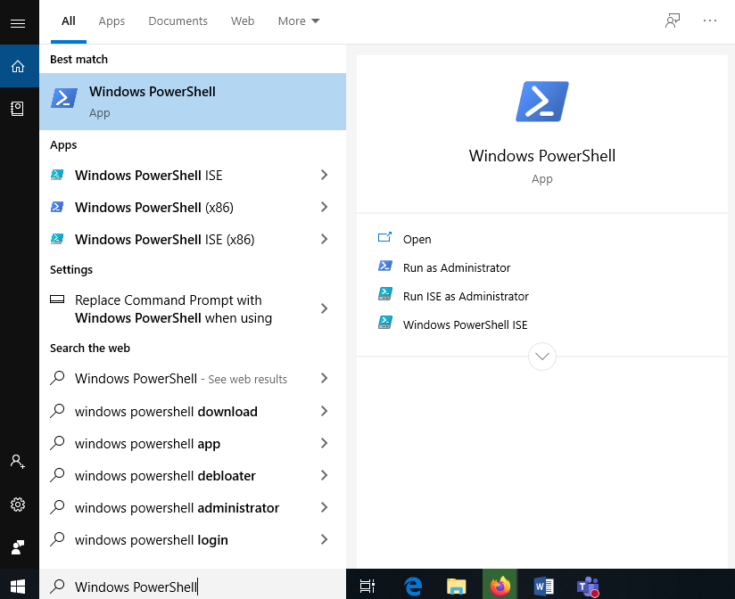
<br>

2. Check Docker is available by printing out the version you have installed:

```shell
docker --version
```
Note: Don’t worry if you have you installed a slightly different version of Docker - that’s OK. What you want to make sure is that it successfully prints out a version instead of a warning/error message (usually in red).


<br>


### Installing the container {#winpro_docker_gds .unlisted .unnumbered}

Once you have Docker installed and running on your machine, installing everything you need to run RStudio and associated packages boils down to the following two steps:

1. Open PowerShell following the same steps as above (you can use the same window as before or a fresh new one).
2. Run (type and hit "Enter") the following command:

```shell
docker pull darribas/gdsr:1.0alpha
```


<br>

You will know this has completed when each line says 'Pull complete'.

<div class="alert alert-info" style="font-size:120%">
<b>IMPORTANT</b>: <br>
    
Make sure you are connected to the internet and it is a stable connection. This step involves the download of large amounts of data (ca. 10GB) so it might take a while. However, it only needs to be run once.
   
</div>

### Check success {#winpro_success .unlisted .unnumbered}

If everything has gone according to plan, you should see `darribas/gdsr` show up on your terminal when you type `docker image ls`:


<br>

## Running RStudio Server {#winpro_run .unnumbered}

The following sections cover how to start up the software you have just installed, use it, and shut it down when you are done.

### Running the container {.unlisted .unnumbered}

To start up Python through Docker, follow these steps:

1. In a new PowerShell window, type the following command to run the container and hit enter: 

```shell
docker run --rm -ti -p 8888:8888 -v ${PWD}:/home/jovyan/work darribas/gds:5.0
```


<br>

You have now started a Python session. 


<div class="alert alert-info" style="font-size:120%">
<b>IMPORTANT</b>: <br>
    
Please do NOT close the PowerShell window until you are finished in this Python session
   
</div>

2. To access this session go to your chosen web browser (e.g. Firefox/Chrome) and type: `localhost:8888` into the search bar. You should see something similar to:

<br>


3. The page that loads will prompt you for a password or a token. This can be found in the text in the terminal following the last command you ran. This will be a long series of numbers and letters will be preceded by `?token=`. Copy this long series of characters and paste into the password box in your browser.

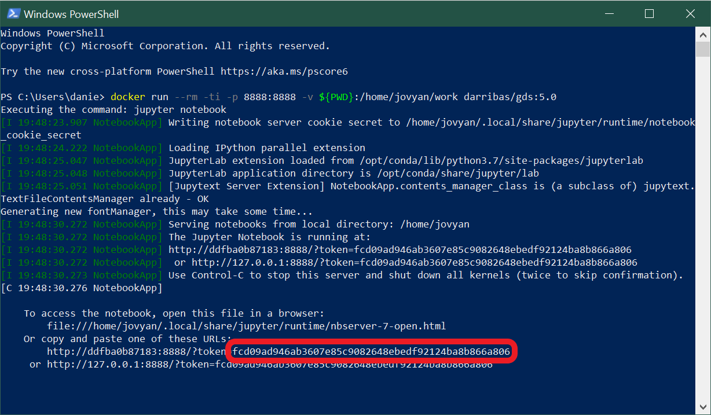


4. Now you are in Jupyter Lab, it should look like this, more or less:


<br>

#### Using RStudio Server {.unlisted .unnumbered}

- This notebook is where you will run your code. Each shaded box is called a kernel. To test this out you can type `print('test')` into one of these kernels. To run the code use the shortcut `Ctrl + Enter`.


<br>

<div class="alert alert-info" style="font-size:120%">
<b>IMPORTANT</b>: <br>
    
Make sure you save files you want to keep **ONLY** _within_ the `work` folder, as this will ensure they are saved on your machine.
    
Everything saved outside the `work` folder will be _destroyed_ as soon as you shut down the session.
   
</div>

- You can save your notebook using **File** > **Save notebook as**


<br>

- You can create new folders to organise your work


<br>

- And you can access other files on your machine through the 'work' folder in the File Browser. From here you can navigate to your Documents and designated folder for this module


<br>

### Ending your session {.unlisted .unnumbered}

Once you have finished in your Jupyter session and have saved all your work, you can end the session from the terminal.

Using `Ctrl + C` will prompt a `y/n` option. Either type `y` or `Ctrl + C` again to end the session. 


<br>

You can now safely shut the terminal window.

<br>

Next time you go to run a Jupyter Notebook you will not need to repeat the whole process as you have already installed Docker and the GDS environment. Instead you can start from [Running Python through Docker](#winpro_run) and carry on from there.

<!--chapter:end:03-win10pro.Rmd-->

# Windows 10 Home/pre-10 {#otherWin .unnumbered}

This guide covers the installation of R and RStudio on machines running Windows 10 Home Edition or versions of Windows prior to Windows 10 (e.g. Windows 7). With this approach, you will install R and RStudio "natively", that is running directly on your operating system. If you are not sure what version of Windows you are running, check out this [guide](#windows-version).

<div class="alert alert-danger" style="font-size:120%">
<b>IMPORTANT</b>: <br>
    
This module has been written using the most up-to-date versions of R, RStudio and relevant packages. To avoid software compatibility issues it is important you have these same versions installed on your home computer.

**Therefore, if you have R or RStudio already installed on your computer, please uninstall them before following the instructions below.**
    
</div>


## Download and Install R  {.unlisted .unnumbered}

### Download R  {.unlisted .unnumbered}

R is the coding software that will execute the code you write in RStudio

**NOTE: You need to install R before you install RStudio**


-  Open the [R download page](https://cran.rstudio.com/) in your browser and click on **Download R for Windows**.  


-  Click on **base** (highlighted in red here) as you are installing R for the first time. 


-  Click on **Download R 4.0.3 for Windows** (highlighted in red here) to start the download. 

### Install R {.unlisted .unnumbered}


-	Navigate to your **Downloads** folder and double click on the **_R-4.0.3-win_** file.

**NOTE: Once you double click on the file, a window might pop up that asks you if you want to allow this app to make changes to your device click _YES_ to continue the installation**


-	A new window will pop up asking you to select a language for the installation. Select **English** and click **_OK_**.


-	The next window shows the Terms and Conditions. Click **_Next_** to continue with the installation. 


-	The next window will ask you to specify where you would like to install R. Leave the default settings and click **_Next_**. 


-	The next window will ask you what components of R you want to install. Leave the default settings (all boxes ticked) and click **_Next_**. 


-	The next window will ask you if you want to customise the startup options.
- Select **No** and click **_Next_**.  


-	The next window will ask you to select/name a start menu folder.
- Leave the default settings (R) and click **_Next_**.  


-	The next window will ask you to select additional task that will be performed while installing R.
- Leave the default (Additional shortcuts unticked,Registry entries ticked) and click **_Next_** .


-	R will now install.


-	Once the installation is complete, click **_Finish_**. 


## Download and Install RStudio  {.unlisted .unnumbered}

### Download RStudio  {.unlisted .unnumbered}

R-Studio is the R user interface in which you can code. 


- Go to the [R-studio download page](https://rstudio.com/products/rstudio/download/).


- On the download page, scroll down and click on the **_Download_** button under **RStudio Desktop**. 


- Click on **Download RStudio for Windows** to download the installation file 

### Install RStudio  {.unlisted .unnumbered}


-	Navigate to your **Downloads** folder and double click on the **RStudio-1.4.1103** file.  
**NOTE: Once you double click on the file, a window might pop up that asks you if you want to allow this app to make changes to your device click _YES_ to continue the installation**


-	In the installation window that opens, click **_Next_**.


- In the next window, you can specify where you want to install RStudio.
- Leave the default settings and click **_Next_**. 


-	The next window will ask you to choose a Start Menu Folder.
- Leave the default settings (RStudio) and click **_Next_**.


-	RStudio is now installing. 


-	Once the intallation is completed, click on **_Finish_**.

## Open RStudio  {.unlisted .unnumbered}


- To open RStudio, click on the Windows logo in the left bottom corner of your screen and either type **_RStudio_** or look for the **RStudio folder** in the menu. 
- Double click on Rstudio to open it. 

<center>

## Install Packages  {.unlisted .unnumbered}

Section on how to install relevant packages for Windows.


**CONGRATULATIONS YOU HAVE NOW SUCCESFULLY INSTALLED R, RStudio AND ALL THE PACKAGES YOU NEED TO COMPLETE THE COURSE.**

**You can now start coding**


<!--chapter:end:04-otherwin.Rmd-->

# Windows Specifications {#windows-version .unnumbered}

## Windows Version {.unnumbered .unlisted}

This guide shows you how to find out what version of Windows you are running.

Here are the steps you need to follow:

1. Right click on the Windows logo in the left bottom corner of your screen and click on _system_.


2. You will find the version of your Windows under _Windows Specifications_ and _Edition_ (here it is Windows 10 Home as an example):


Knowing the version you are running, you can then follow on to install Python for your version:

- If you are running Windows 10 Pro, head over [here](#win10pro)
- If you are running other versions, use [this guide](#otherWin)

## Windows Architechture {#windows-arch .unnumbered .unlisted}

<div class="alert alert-danger" style="font-size:120%">
<b>IMPORTANT</b>: <br>

This is only relevant if you do _not_ have Windows 10 Pro

</div> 

If you are [installing Python natively](#otherWin), you will need to know whether your computer is 32bit or 64bit, that is its architecture. Most modern computers are 64bit, so there is a good chance that is your case. However, please make sure to avoid trouble down the installation process.

To check which architecture you have, follow these steps:

1. Right click on the Windows logo in the left bottom corner of the task menu and select **System**


This will bring you to your system information page

2. The architecture of your computer can be found under the **System type** section (highlighted in red, for this example it is 64-bit):


Knowing which architecture your computer has allows you to download the right version of Miniconda, one of the [requirements](#otherwin_reqs) for successful installation.

<!--chapter:end:05-version.Rmd-->

# Contributors  {#contributors .unnumbered}

This project was originally conceived by [Dani Arribas-Bel](https://darribas.org) and [Francisco Rowe](https://www.franciscorowe.com/), from the [Geographic Data Science Lab](https://www.liverpool.ac.uk/geographic-data-science/).

The following additional contributors have helped improve the resource:

- Dominik Fahrner
- Natalie Rose
- Michael Mahony
- Caitlin Robinson

<!--chapter:end:06_contributors.Rmd-->


# References {-}


<!--chapter:end:07-references.Rmd-->

